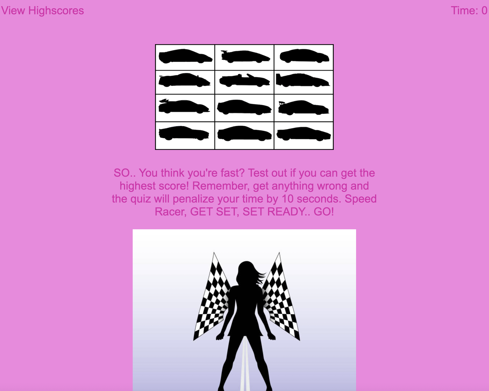

# codequiz

# Table of Contents
• Description

•Navigation

•Screenshot of Site

• Links

• References

# Description

This app runs in the browser and lineaments dynamically updated HTML and designed eloquently by CSS and is powered by js. 

The user will be able to take a quiz to test their knowledge about super cars.

A time deduction is in place if a question is answered wrong.

The user can save, view, or delete their high scores. 
# Navigation
The user will be given notice of a time deduction rule on the homepage as well as the option to click the begin button to start the quiz. The high scores will be in the left and the time will be displayed on the right.

Once the user clicks the begin button found on the bottom of the page the user will be automatically given a of qustion about super cars.

The quiz will change the question and set of answers as soon as the user clicks an answer to the question given.

The user will notice the time in the right cornner change if the user gets a deduction due to choosing the wrong answer.

Once the user is finished they are given notice to input their initals in a box in which they will submit.

Once submitted the user will be redirected to a new page will the high scores.

If the user wants to view the scores they got previosly or clear there scores due to embarrassment no worries they just simply need to click clear high scores then click the back button. The user will be redirected to the home page.

# Screenshot of site
<!-- add the right screenshot -->

# Links

<!-- add the correct link in the () -->

[Repo link](https://github.com/SarahAmel/codequiz/)   

[Live link](https://sarahamel.github.io/codequiz/)

[Linkedin Link](https://www.linkedin.com/in/sarah-attar-477312235/)

# Contact
Email: sarahattar76@gmail.com

# References
The play back zoom videos from the Units helped immensely as well as the startup video that I used extensively for startup code.

The staff within the UCF bootcamp helped me tremendously.

I am greatly appreciative of all the knowlegeable Tutors available and TA's who helped after or before class.